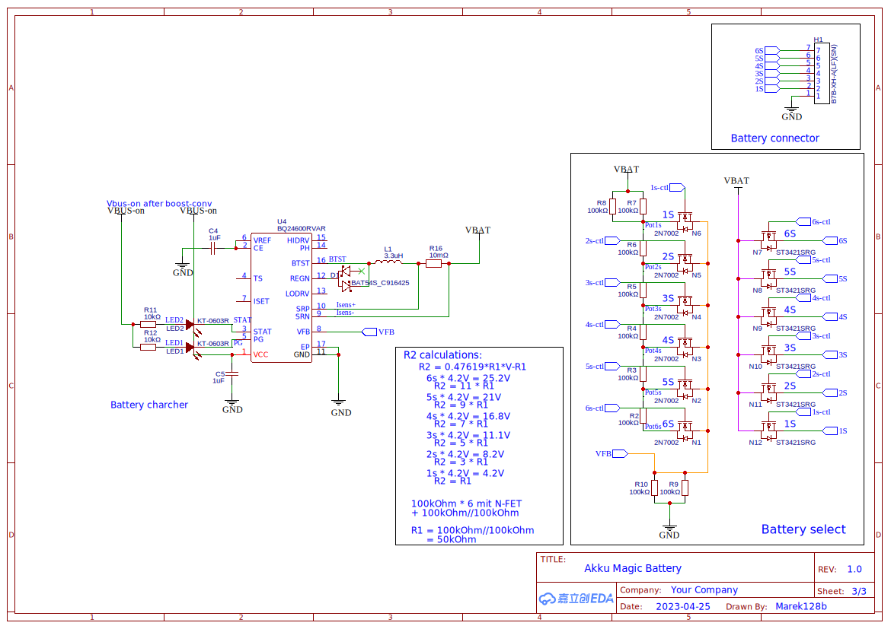
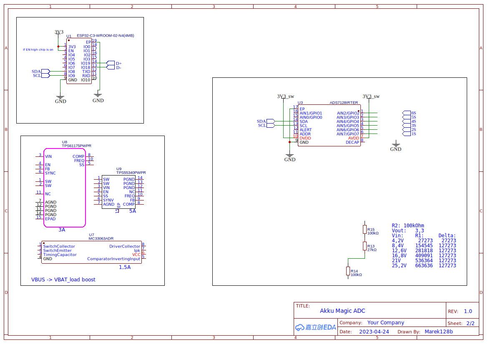
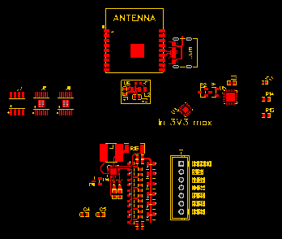
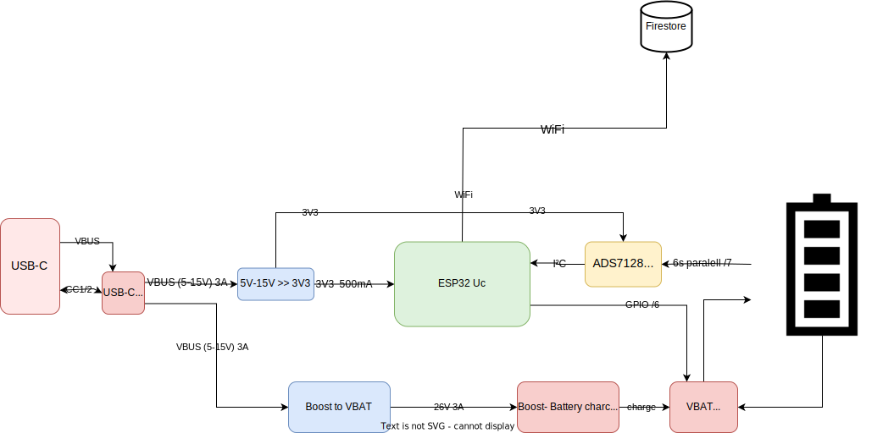

# Hardware

**Table of Contents**
- [Hardware](#hardware)
  - [description](#description)
  - [Schematic](#schematic)
    - [Link](#link)
  - [PCB](#pcb)
  - [diagramm](#diagramm)

---
## description

 

---
## Schematic
### Link
https://easyeda.com/editor#id=32b7ace7bde44caea4c9ae37066067a1|f48f90d7611346188e835fb0149f18e7

## PCB

---
## diagramm

